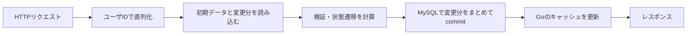

# Codex conversation

- Session: 01a0d46a-1d0c-72d2-a1c4-ab0076dbcc4b

<!-- codex-hook-format: 5; tool results omitted -->

---
## USER

$isucon-agent 最新RUNの計測結果などから、現在のボトルネックと将来的にボトルネックになりそうな部分を分析して、構造的な抜本的解決を提案をしてください。まずは1サーバー前提でよいです

## ASSISTANT

`isucon-agent`スキルに沿って、最新のfinalized RUNと現行のGo実装・構成を読み取りで確認します。まず同じRUN・時間窓の計測値で処理量と待ちを比較し、1サーバーで効く構造的な改善案まで絞ります。今回は提案までで、変更やベンチ実行はしません。

## TOOL

```sh
pwd && rg --files -g 'AGENTS.md' -g 'Taskfile*.yml' -g 'run.json' -g 'SKILL.md' -g 'README.md' | head -100
```
## TOOL

```sh
git status --short && ls -la && ls -la runs 2>/dev/null
```
## TOOL

```sh
cat .agents/skills/isucon-agent/SKILL.md && sed -n '1,200p' Taskfile.yml
```

## TOOL

```sh
cat runs/20260925-020054/run.json
```
## TOOL

```sh
rg -n '^  (q|artifacts-run|digest|report|analy|run-)' Taskfile.yml && sed -n '1,220p' tools/analysis/sources.yaml && ls tools/analysis/schema
```
## TOOL

```sh
rg --files docs/official webapp/go mysql nginx tools/contest | head -150 && cat runs/scores.tsv
```
## TOOL

```sh
ls -lah runs/20260925-020054 | head -100 && rg --files runs/20260925-020054 | sed -n '1,130p'
```

## TOOL

```sh
jq '{id, status, score, started_at, ended_at, finalized_at, load_window, missing, artifact_status, summary, benchmark} | with_entries(select(.value != null))' runs/20260925-020054/run.json
```
## TOOL

```sh
rg -n '^  (q|artifacts-run|analyze|report|digest|runs)' Taskfile.yml && sed -n '1,160p' tools/analysis/schema/00-base.sql && sed -n '1,180p' tools/analysis/schema/bottleneck.sql
```
## TOOL

```sh
rg -n '^#|^##|^###' docs/official/*.md && sed -n '1,220p' webapp/go/README.md && rg -n '^func |^type |^var |^const ' webapp/go/main.go webapp/go/admin.go
```
## TOOL

```sh
head -40 runs/20260925-020054/alp.txt && head -20 runs/20260925-020054/isucon-1-mysql-digest.tsv && head -20 runs/20260925-020054/upstream-breakdown.tsv
```

## TOOL

```sh
sed -n '780,825p' Taskfile.yml && jq 'keys, (.artifacts | type), (.missing | type), (.load_window), (.bench | type), (.status | type), (.passed | type)' runs/20260925-020054/run.json
```
## TOOL

```sh
sed -n '180,420p' tools/analysis/schema/bottleneck.sql && sed -n '1,180p' tools/analysis/schema/semantic.sql
```
## TOOL

```sh
sed -n '180,310p' docs/official/manual.md && sed -n '1,110p' docs/official/applicationmanual.md
```
## TOOL

```sh
sed -n '1,165p' webapp/go/main.go && sed -n '1,160p' mysql/conf.d/my.cnf && sed -n '1,100p' nginx/sites-available/isuconquest.conf
```

## ASSISTANT

最新finalized RUNは `20260925-020054`（40,462点）で、記録上の負荷窓は約94.8秒です。HTTP集計ではプレゼント受取の累積応答時間が最大ですが、応答時間の大きさだけではCPU・DB・待ちのどれが律速か分かりません。次に同じ窓の資源量とSQL実行量を突き合わせます。

## TOOL

```sh
task q -- 
```

## TOOL

```sh
task q -- 
```

## TOOL

```sh
task q -- 
```

## TOOL

```sh
sed -n '1130,1425p' webapp/go/main.go && sed -n '440,580p' webapp/go/main.go
```
## TOOL

```sh
sed -n '165,310p' webapp/go/main.go && sed -n '680,1025p' webapp/go/main.go
```
## TOOL

```sh
rg -n 'CREATE TABLE.*(user_presents|user_items|user_cards|users|user_sessions|user_one_time_tokens)|KEY|INDEX|user_presents' webapp/sql/setup/1_schema.sql webapp/sql/3_schema_exclude_user_presents.sql webapp/sql/4_alldata_exclude_user_presents.sql | head -150 && cat mysql/mysql.conf.d/mysqld.cnf && cat nginx/conf.d/local-upstream.conf
```
## TOOL

```sh
jq '{run_id,passed,phase,required_artifacts, artifacts: [.artifacts[] | select(.status != "ok") | {name,status,missing,reason}]}' runs/20260925-020054/run.json
```

## TOOL

```sh
task q -- 
```

## TOOL

### `clock__curr_time`

```javascript
tools.clock__curr_time({})
```

## ASSISTANT

61秒の負荷窓では `isucon-1` の2 CPUが118.6 CPU秒／122 CPU秒まで埋まり、内訳はMySQLが73.2、Goが37.8 CPU秒でした。同じ窓でMySQLは約40.9万クエリ、GoのDB接続プールは最大50本に達し、待ちが累積約1,087秒あります。先に「クエリ数を減らす設計」を検討すべき状況です。受取処理の行単位更新と、全APIに共通する照会を現行コードで確認しています。

## TOOL

```sh
task q -- 
```

## TOOL

```sh
sed -n '578,688p' webapp/go/main.go && sed -n '137,155p' webapp/sql/setup/1_schema.sql && sed -n '315,360p' webapp/go/main.go && sed -n '1850,1930p' webapp/go/main.go
```
## TOOL

```sh
rg -n 'cache|sync\.Map|mutex|RWMutex|prepared|BEGIN|FOR UPDATE|user_presents' webapp/go/main.go webapp/go/admin.go | head -100 && rg -n 'slow_query|performance_schema|general_log|innodb' mysql/conf.d/* mysql/mysql.conf.d/*
```
## TOOL

```sh
go tool pprof -top -nodecount=30 runs/20260925-020054/isucon-1-go-cpu.pprof 2>&1 | head -55
```

## TOOL

```sh
sed -n '1030,1130p' webapp/go/main.go && sed -n '215,490p' webapp/go/admin.go
```
## TOOL

```sh
sed -n '1688,1860p' webapp/go/main.go && sed -n '1480,1690p' webapp/go/main.go
```
## TOOL

```sh
du -h webapp/sql/* 2>/dev/null | sort -h | tail -20 && sed -n '1,100p' webapp/sql/init.sh && sed -n '1,100p' tools/contest/deployments.yaml
```

## TOOL

```sh
task q -- 
```

## ASSISTANT

最新のfinalized RUN `20260925-020054` は **40,462点、整合性チェック通過**でした。分析に使った負荷窓は61秒です。必須成果物の欠損はなく、`isucon-2`〜`5` の空のSQL digest 4件はMySQLの負荷が `isucon-1` に集中している構成と整合します。[run.json](/Users/mineo/worktrees/EkeMinusYou/isucon12-final-3/monday/runs/20260925-020054/run.json)

### 現在の律速

**`isucon-1` のMySQLを中心としたCPU飽和が主因**です。同じ61秒間に、2 CPUの容量122 CPU秒に対してホスト全体で118.6 CPU秒を使用し、MySQLが73.2、Goが37.8 CPU秒を占めました。60／61サンプルでCPU使用率が80％以上です。一方、ほかの4台のCPU使用率は0.5〜9.9％で、現状の負荷は実質1台で処理されています。

その間にMySQLは約40.9万クエリを処理しました。HTTPは22,279件なので、概算で**1リクエスト当たり18件超**のクエリです。GoのDB接続プールは上限50本に達し、接続待ちの累積は約1,087秒でした。これは待ちを各リクエストで合算した値です。MySQL自体のCPUが埋まっているため、プール上限だけを増やしても処理能力の増加は見込みにくいです。

最も時間を使うAPIはプレゼント受取で、3,404件・累積応答時間1,198.5秒・平均352msです。[受取処理](/Users/mineo/worktrees/EkeMinusYou/isucon12-final-3/monday/webapp/go/main.go:1321) はプレゼントをまとめて取得・更新した後、**各プレゼントごとに**アイテムマスタ照会、所持品照会、所持品更新などを繰り返します。SQL digestでは同一RUN全体で `item_masters` 照会4.49万回、`user_items` 照会3.64万回、`user_items` 更新3.37万回でした。プレゼントの受取済み更新も3,408回で計7.31万行に及びます。digestは初期化を含む収集期間全体の値なので、61秒窓のHTTP時間との比率には使っていません。

### 抜本策と次に現れる律速

| 優先 | 提案 | 効果と残る仕事 |
|---|---|---|
| 1 | **受取を「プレゼントごとのSQL」から「1リクエストの集合処理」へ変更**。同一トランザクション内で対象を確定し、種別・アイテムIDごとに付与量を集計して、coin更新、所持品更新、カード追加をまとめる。 | 大量の往復SQLと接続占有を減らせます。受取済みプレゼント約21行／回の永続化は残ります。 |
| 2 | **マスタをGoに読み込み、管理画面の更新確定時に一括で差し替える**。version、item、gachaと抽選重みを対象にする。 | 全API共通のversion照会や、受取・ガチャ中の反復照会を減らせます。管理画面更新の即時反映が必須です。 |
| 3 | **100万点を狙う段階では、ユーザ単位の永続状態へデータモデルを集約**。プレゼント受取状態、所持品、coinなどをユーザ単位で読み、操作を計算して少数の書込みで確定する。 | 行ごとの更新と索引更新そのものを減らす案です。管理画面からの参照、再起動後の復元、同一ユーザ操作の直列化まで含む大きな変更になります。効果量は未計測です。 |

1と2でMySQLの仕事が減ると、次は**GoのCPU**が先に制約になる見込みです。現時点でも37.8 CPU秒を使っています。ディスクも同じ窓で約2.72GBを書き込んでいますが、平均使用率54％・書込み待ち約1msで、**現在の第一律速とは言えません**。書込み件数を残したまま得点だけ伸ばすと、将来はディスクも制約になります。Nginxは2.6 CPU秒で、現時点の優先対象ではありません。

正当性の条件は、ワンタイムトークンの一度限りの処理、`x-isu-date` とJST基準、受取結果の即時反映、管理画面更新の即時反映、再起動後の永続性です。[公式仕様](/Users/mineo/worktrees/EkeMinusYou/isucon12-final-3/monday/docs/official/manual.md:179) 対象はまず `isucon-1` のGoアプリとMySQLです。**今回、変更・デプロイ・ベンチ実行はしていません。**

まず **1・2をまとめて実装する方向**と、**3のユーザ状態集約を先に詳細設計する方向**のどちらで進めますか。

## USER

3について詳細設計してください

## ASSISTANT

ユーザ単位の状態集約について、現行のテーブルと各APIの更新・参照条件を洗い直します。初期データの規模と、管理画面・再起動・同時リクエストまで含めて、1サーバーで成立する保存形式と移行手順を具体化します。今回も設計のみで、変更やベンチ実行はしません。

## TOOL

```sh
sed -n '1,285p' webapp/sql/setup/1_schema.sql && sed -n '1,200p' webapp/sql/init.sh
```
## TOOL

```sh
sed -n '145,220p' webapp/go/admin.go && sed -n '522,645p' webapp/go/admin.go && sed -n '1425,1505p' webapp/go/main.go && sed -n '2000,2225p' webapp/go/main.go
```
## TOOL

```sh
rg -n 'func |SELECT |UPDATE |INSERT |DELETE |Beginx|Commit\(' webapp/go/main.go webapp/go/admin.go | sed -n '1,320p'
```
## TOOL

```sh
rg -n 'DB_NAME|MYSQL_HOST|deploy-app|db-recreate|deploy-mysql|setup-webapp|setup-mysql|apply-roles' Taskfile.yml | head -100 && git status --short
```

## TOOL

```sh
ssh -o BatchMode=yes -o ConnectTimeout=5 -o RequestTTY=no -o LogLevel=ERROR ubuntu@isucon-1 'sudo mysql -N -e "SELECT TABLE_NAME,TABLE_ROWS,ROUND((DATA_LENGTH+INDEX_LENGTH)/1024/1024,1) MiB FROM information_schema.TABLES WHERE TABLE_SCHEMA=\"isucon\" AND TABLE_NAME IN (\"users\",\"user_presents\",\"user_cards\",\"user_items\",\"user_sessions\",\"user_one_time_tokens\") ORDER BY TABLE_NAME"'
```
## TOOL

```sh
sed -n '605,645p' webapp/go/admin.go && sed -n '365,449p' webapp/go/main.go && sed -n '1990,2035p' webapp/go/main.go
```
## TOOL

```sh
rg -n 'initial|schema|LOAD DATA|present|initialize' docs/solutions docs/special-sources README.md | head -100 && head -60 runs/20260925-020054/user-transitions.json
```

## TOOL

```sh
sed -n '1,380p' docs/solutions/wal-backed-in-memory-state.md
```
## TOOL

```sh
ssh -o BatchMode=yes -o ConnectTimeout=5 -o RequestTTY=no -o LogLevel=ERROR -o UpdateHostKeys=no -o UserKnownHostsFile=/dev/null -o StrictHostKeyChecking=accept-new ubuntu@isucon-1 'free -b && nproc && df -B1 /var/lib/mysql | tail -1 && sudo mysql -N -e "SHOW VARIABLES WHERE Variable_name IN (\"innodb_buffer_pool_size\",\"innodb_flush_log_at_trx_commit\",\"max_connections\")"'
```
## TOOL

```sh
sed -n '1,180p' docs/solutions/README.md && sed -n '1,210p' webapp/go/id_generator.go && sed -n '1,130p' webapp/go/profile.go
```

## ASSISTANT

実データの概数は `user_presents` 約365万行、`user_cards` 約74万行、ユーザ約1.4万人でした。`isucon-1` はメモリ約3.9GB、MySQLのバッファプール1GBで、調査時点の空き余裕も小さいため、全ユーザ状態をGoへ常駐させる設計は採りません。初期データをDBの読み取り専用基盤として残し、活動中ユーザの変更分だけを集約する形を詰めます。

## TOOL

```sh
ssh -o BatchMode=yes -o ConnectTimeout=5 -o RequestTTY=no -o LogLevel=ERROR -o UpdateHostKeys=no -o UserKnownHostsFile=/dev/null -o StrictHostKeyChecking=accept-new ubuntu@isucon-1 'ps -eo comm,rss --sort=-rss | head -8; sudo mysql -N -e "SELECT TABLE_NAME,ROUND(DATA_LENGTH/1024/1024,1),ROUND(INDEX_LENGTH/1024/1024,1) FROM information_schema.TABLES WHERE TABLE_SCHEMA=\"isucon\" AND TABLE_NAME IN (\"user_presents\",\"user_cards\",\"user_items\") ORDER BY TABLE_NAME"'
```
## TOOL

```sh
sed -n '1300,1425p' webapp/go/main.go && sed -n '205,282p' webapp/go/main.go && sed -n '140,250p' docs/official/manual.md
```
## TOOL

```sh
rg -n '^  - table:|view:|windowed:' tools/analysis/sources.yaml | head -115 && jq '.summary | {sessions,api_requests,requests_with_identity}' runs/20260925-020054/user-transitions.json
```

## TOOL

```sh
ssh -o BatchMode=yes -o ConnectTimeout=5 -o RequestTTY=no -o LogLevel=ERROR -o UpdateHostKeys=no -o UserKnownHostsFile=/dev/null -o StrictHostKeyChecking=accept-new ubuntu@isucon-1 'sudo mysql -N --connect-timeout=5 -e "SELECT \"presents\", COUNT(*), ROUND(AVG(n),1), MAX(n) FROM (SELECT user_id,COUNT(*) n FROM isucon.user_presents GROUP BY user_id) x; SELECT \"cards\", COUNT(*), ROUND(AVG(n),1), MAX(n) FROM (SELECT user_id,COUNT(*) n FROM isucon.user_cards GROUP BY user_id) x"'
```

## ASSISTANT

## 提案する構成

**MySQLにある初期データを読み取り専用の土台とし、ゲーム中の変更分だけをユーザ単位で永続化します。** Goは活動中ユーザの状態を容量制限付きでキャッシュします。成功レスポンスはMySQLのコミット後に返す設計です。これなら更新の即時反映と再起動後の復元を、非同期書込みに頼らず満たせます。



### 保存形式

| 保存先 | 内容 | 負荷中の扱い |
|---|---|---|
| 既存の `users`、`user_cards`、`user_items`、`user_presents` など | `/initialize` が作る初期状態 | 読み取り専用。受取のたびに初期プレゼント行を更新しない |
| `user_state_core` | coin、日時、セッション、トークン、BAN、ログインボーナス進捗、デッキの変更分、状態番号 | ユーザIDを主キーとする |
| `user_state_inventory` | 所持品・カードの新規分と変更分 | 変更がある操作だけ更新 |
| `user_state_inbox` | 初期プレゼントの「ID→受取日時」、新規プレゼント、全員プレゼント履歴 | 変更がある操作だけ更新 |

可変長の部分は版番号付きで符号化し、大きくなるユーザは部品を分割します。**初期状態を毎回まるごとコピーしない**ことが要点です。現在のDBにはプレゼント約365万行、カード約74万行があります。ユーザ別の最大件数はプレゼント664、カード166でした。一方、`isucon-1` はメモリ約3.9GB・スワップなしで、調査時の利用可能量は約143MBです。全件をGoに載せる余裕はありません。これらは保存形式を決めるための現ホストの読み取り値で、最新RUNの負荷窓の計測値とは区別しています。[現行スキーマ](/Users/mineo/worktrees/EkeMinusYou/isucon12-final-3/monday/webapp/sql/setup/1_schema.sql:23)

### リクエストの処理

同じユーザの操作はGoで直列化します。読み込み時は初期データに永続化済みの変更分を重ね、状態を作ります。更新系は、現在の状態から結果を計算した後、`core` の状態番号を確認しながら必要な部品だけを**一つのMySQLトランザクション**で保存します。コミットが成功してからキャッシュを公開します。失敗時は計算結果を捨て、コミット成否が不明な場合はそのユーザをDBから読み直します。キャッシュは例えば32MiBから始め、コミット済みの状態だけを退避可能にします。

最重要の[プレゼント受取](/Users/mineo/worktrees/EkeMinusYou/isucon12-final-3/monday/webapp/go/main.go:1321)では、指定IDの初期プレゼントを一括取得し、既に受け取ったIDを除き、付与内容をメモリで集計します。保存するのは受取日時の変更分、coin、所持品、追加カードです。現在のような**プレゼント1件ごとの照会・更新**と、約21行／回の初期プレゼント更新をなくす狙いです。受取後の一覧とレスポンスは変更分を重ねて生成します。

`GET /present/index` は初期プレゼントと新規プレゼントを結合し、受取済みを除いてから、現行どおり `created_at DESC, id ASC` で並べて101件目から `isNext` を決めます。初期プレゼントはユーザ別に最大664件なので、まずは必要なユーザ分を一括取得する設計が明快です。ただし、その全件を全ユーザ分キャッシュしません。[現行の一覧処理](/Users/mineo/worktrees/EkeMinusYou/isucon12-final-3/monday/webapp/go/main.go:1278)

セッションはユーザ状態に保存し、セッションIDから所有ユーザを引く小さな索引をGoに持ちます。再起動時は永続化済みの `core` から再構築します。管理画面のユーザ表示とBANも同じ状態経路を使います。マスタ更新は現在のMySQLトランザクションを維持し、確定後にGo側のマスタを一括差し替えます。[管理画面の参照・更新](/Users/mineo/worktrees/EkeMinusYou/isucon12-final-3/monday/webapp/go/admin.go:156)

### 初期化と正当性

`POST /initialize` ではユーザ操作を止め、既存SQLで初期状態を再作成し、変更分テーブルとGoのキャッシュを消去します。現行初期化は最新RUNで約26.5秒で、公式上限は60秒です。再起動だけの場合はテーブルを消さず、DBの変更分から状態を復元します。[公式の初期化・即時反映・再起動要件](/Users/mineo/worktrees/EkeMinusYou/isucon12-final-3/monday/docs/official/manual.md:179)

実装前に、現行のエラー時の副作用も固定する必要があります。特にワンタイムトークンは現在、後続の操作が失敗しても先に消費される場合があります。また、現行の受取SQLは指定IDの所有ユーザで絞っていません。ユーザ単位の設計ではこの2点が挙動差になり得るため、公式要件と既存の期待レスポンスに照らして扱いを決め、重複受取・同時操作・BAN・管理画面・再起動を重点確認します。

### 効果の見込みと判定

最新RUNでは61秒にHTTP 22,279件、MySQL約40.9万クエリでした。設計上、頻繁な操作を「プレゼント件数に比例するSQL」から「初期データの一括読込みと、変更部品の数件の書込み」へ変えられます。ただし、**100万点に届く効果量は未確定**です。次のRUNではスコアに加え、同一負荷窓のSQL件数／リクエスト、MySQLとGoのCPU秒／リクエスト、接続待ち、書込み量／リクエスト、受取の遅延を比較します。MySQLの仕事が減れば、Goの状態復元・符号化とMySQLのコミットが次の制約候補です。

実装対象はまず `isucon-1` のGoコードとSQL初期化・スキーマです。**今回は設計のみで、ファイル変更・デプロイ・ベンチ実行はしていません。** この構成で実装に進めますか。

